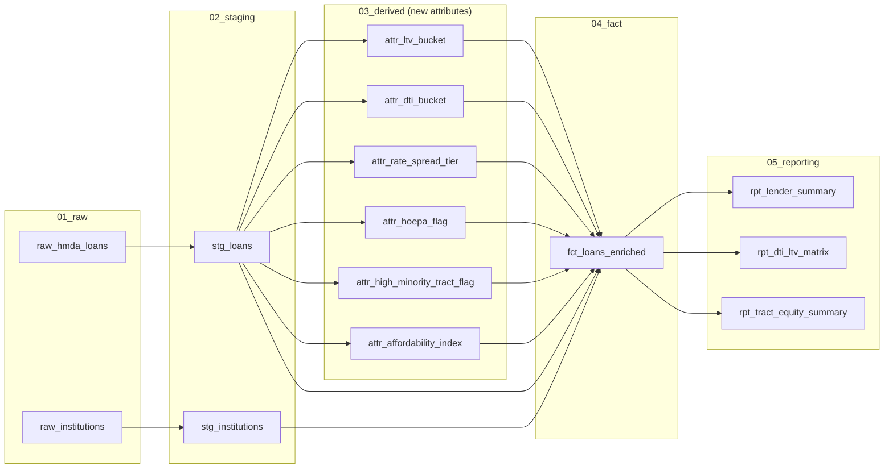

# Attribute Lineage Agent

An AI agent that answers "where did this number actually come from?" for a
multi-table loan data pipeline — tracing any output column, hop by hop,
through joins and derivations, back to its true raw source.

```
$ python -m lineage_agent.cli trace fct_loans_enriched dti_bucket

Lineage trace for fct_loans_enriched.dti_bucket:
      fct_loans_enriched.dti_bucket
  <-  attr_dti_bucket.dti_bucket
  <-  stg_loans.debt_to_income_ratio_raw
  <-  raw_hmda_loans.debt_to_income_ratio

Ultimate source: 'debt_to_income_ratio' on 'raw_hmda_loans' (a raw source table).
Full upstream dependency chain (10 models): raw_hmda_loans, raw_institutions,
stg_loans, stg_institutions, attr_affordability_index, attr_dti_bucket,
attr_high_minority_tract_flag, attr_hoepa_flag, attr_ltv_bucket, attr_rate_spread_tier
```

## Why this exists

At Morgan Stanley I build LLM-powered agents that trace end-to-end attribute
lineage across a multi-system loan data pipeline — capturing how a field on a
downstream report was joined, transformed, and derived from raw source data,
so analysts and auditors don't have to reverse-engineer SQL by hand.

That work is proprietary. This is a from-scratch rebuild of the same pattern
against **public** mortgage data (no proprietary code, schemas, or data), so
the design and the reasoning behind it can actually be shown to someone
outside the firm.

## What it does

1. **Ingests real, public loan-level data** — HMDA (Home Mortgage Disclosure
   Act) records from the FFIEC/CFPB Data Browser API, the same category of
   regulatory loan data used across the mortgage industry.
2. **Runs a 5-layer SQL pipeline** (raw → staging → derived attributes →
   fact → reporting) that joins loan records against a lender reference table
   and derives 8+ new analytical attributes that don't exist in the raw feed
   (LTV/DTI buckets, a HOEPA high-cost flag, a fair-lending equity cut, a
   composite affordability index, etc.) — the same "multi-table joins to
   surface new attributes" pattern as production ETL work.
3. **Parses its own SQL** (via `sqlglot`, no query execution needed) to build
   a directed lineage graph — the *same* graph that determines safe pipeline
   execution order, and that the agent walks to answer lineage questions.
4. **Explains lineage in plain language.** The graph traversal always works
   with zero dependencies. Set `ANTHROPIC_API_KEY` and it also asks Claude to
   turn the raw trace + SQL into a natural-language explanation — a real LLM
   call, not a canned string, with automatic fallback if no key is set.

## Architecture



The **lineage agent** (`lineage_agent/`) sits on top of this graph, not
inside it — it's a static-analysis layer, so tracing lineage never requires
running the pipeline or querying the warehouse.

## Data

[HMDA loan-level data](https://ffiec.cfpb.gov/documentation/api/data-browser/)
is public, free, and requires no API key or signup. Sample used here: Cook
County, IL (Chicago), 2024, loans that were originated. The repo ships a
checked-in 3,000-row sample (`data/sample/`) so the pipeline runs immediately
after cloning — no download needed for a demo. `data/raw/` (full pulls, tens
of thousands of rows) is gitignored; re-fetch it any time with:

```bash
python scripts/download_hmda.py --state IL --county 17031 --year 2024 --make-sample
```

Swap `--state`/`--county`/`--year` for any US geography HMDA covers.

## Quickstart

```bash
git clone https://github.com/HimaniMehta425/attribute-lineage-agent.git
cd attribute-lineage-agent
pip install -r requirements.txt

# Build the warehouse (DuckDB, local file, no setup) from the sample data
python -m pipeline.run_pipeline

# Ask the agent where an attribute came from
python -m lineage_agent.cli trace fct_loans_enriched dti_bucket
python -m lineage_agent.cli trace fct_loans_enriched dti_bucket --llm   # needs ANTHROPIC_API_KEY

# See every model and the columns it produces
python -m lineage_agent.cli list

# Export the full lineage graph as Mermaid
python -m lineage_agent.cli graph
```

### Running on Snowflake instead of DuckDB

The SQL in `sql/` is engine-agnostic (the only DuckDB-specific bit is
`read_csv_auto` in the raw layer). To point the same pipeline at a real
Snowflake warehouse:

```bash
export PIPELINE_ENGINE=snowflake
export SNOWFLAKE_ACCOUNT=...
export SNOWFLAKE_USER=...
export SNOWFLAKE_PASSWORD=...
export SNOWFLAKE_WAREHOUSE=...
export SNOWFLAKE_DATABASE=...
pip install snowflake-connector-python
python -m pipeline.run_pipeline
```

## Data quality handling

Real regulatory data is messy, and the pipeline is explicit about it rather
than silently coercing bad values:

- HMDA filers report some numeric fields as the literal strings `"Exempt"`
  (legally declined to report) or `"NA"`. The raw layer loads everything as
  `VARCHAR` on purpose; staging (`sql/02_staging/stg_loans.sql`) is where
  those sentinels are explicitly converted to `NULL`, so the decision is
  visible and testable (see `tests/test_pipeline.py::test_staging_cleans_sentinel_values`).
- `debt_to_income_ratio` is reported as *either* an exact percentage (`"49"`)
  or a pre-bucketed range (`"30%-<36%"`) depending on the filer, with no
  documented rule for which. `attr_dti_bucket.sql` normalizes both formats
  into one consistent set of buckets.

## Testing

```bash
python -m pytest tests/ -v
```

15 tests covering: the lineage graph is a valid DAG, execution order respects
every dependency, column-level traces resolve to the correct true raw source,
sentinel values never leak past staging, and the fact table's joins don't fan
out rows.

## Repo layout

```
scripts/download_hmda.py   # pulls public HMDA data from the FFIEC API
sql/01_raw/                # loads CSVs as-is (VARCHAR, no cleaning)
sql/02_staging/            # type casting, sentinel cleanup, surrogate keys
sql/03_derived/            # one new attribute per model
sql/04_fact/                # multi-table join: staging + lender ref + all attributes
sql/05_reporting/           # aggregates for downstream reporting
pipeline/                  # executes models in dependency order (DuckDB or Snowflake)
lineage_agent/             # parses SQL -> builds lineage graph -> explains it (+ optional LLM narrative)
tests/                     # pytest suite
```

## License

MIT
